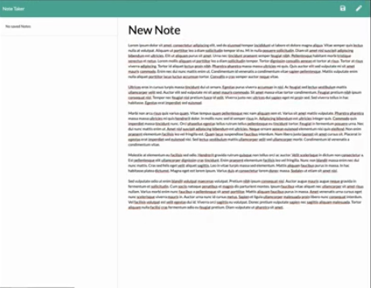

# Unit 11 Express Homework: Note Taker

## Description
Application used to write, save, and delete notes. 

## User Story
AS A user, I want to be able to write and save notes. I WANT to be able to delete notes I've written before. SO THAT I can organize my thoughts and keep track of tasks I need to complete

## Business Context
For users that need to keep track of a lot of information, it's easy to forget or be unable to recall something important. Being able to take persistent notes allows users to have written information available when needed.

## Acceptance Criteria
* Application allows users' to create and save notes.
* Application allows users' to view previously saved notes.
* Application allows users' to delete previously saved notes.

## Video Demo

## License

Copyright (c) 2020 James_Hudgins

## Contributing
This application was developed by James Hudgins. TEAM-GENERATOR was made possible with the following technologies:
* HTML 5
* CSS 3
* Bootstrap
* [Express](https://www.npmjs.com/package/express)
* [Node.js](https://nodejs.org/api/fs.html)

## Tests
There are no tests for this application.

## Questions
Questions regarding this application should be sent via email to, james.hudgins.work@gmail.com. You can also contact me on github with additional questions -> https://github.com/Unbukn/

